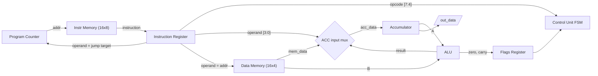
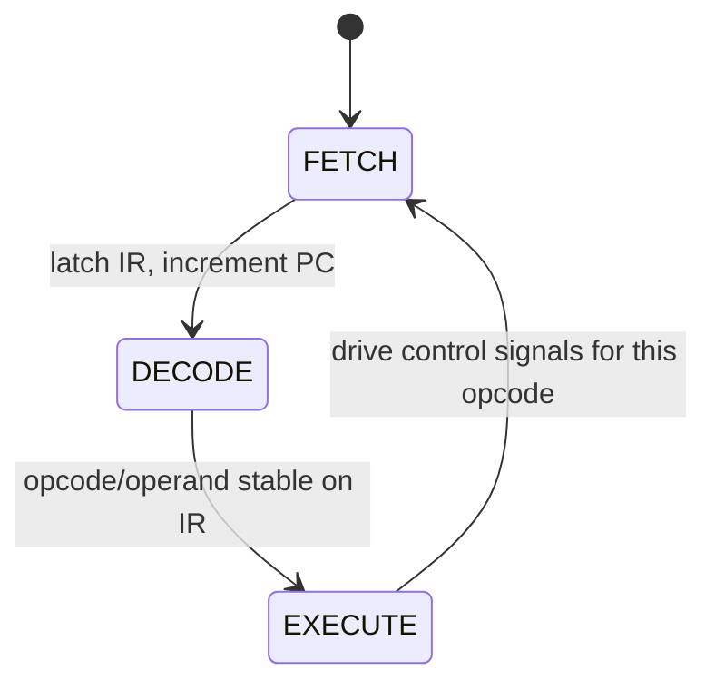
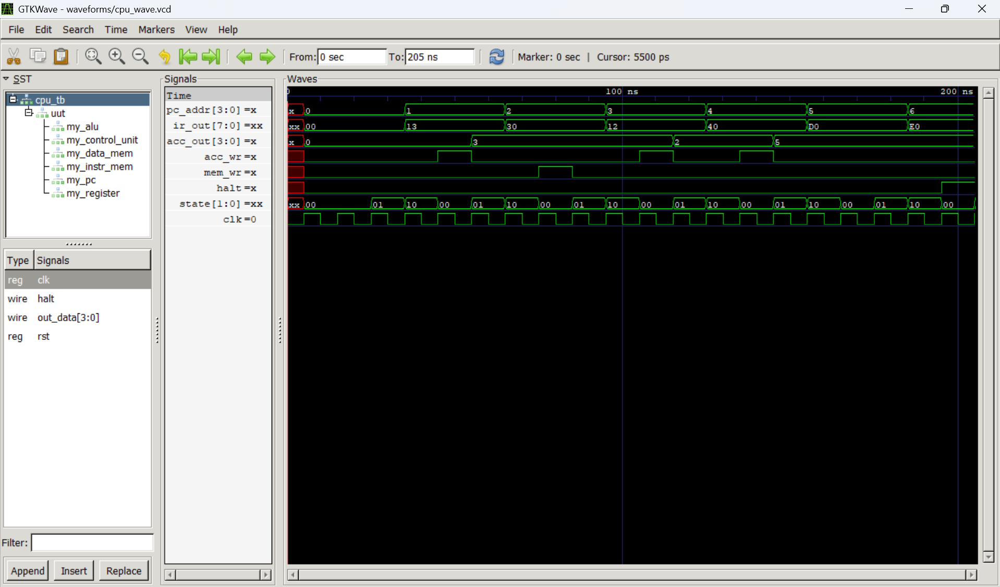

# 4-Bit CPU in Verilog

A 4-bit accumulator-based CPU I designed and built in Verilog: 15-instruction ISA, multi-cycle FSM control unit, registered flags for conditional branches. All three test programs pass in Icarus Verilog simulation with a self-checking testbench.

## Architecture

| Property | Value |
|----------|-------|
| Data Width | 4 bits |
| Instruction Width | 8 bits (4-bit opcode + 4-bit operand) |
| Architecture | Accumulator-based |
| Execution | Multi-cycle (FETCH → DECODE → EXECUTE) |
| Instruction Memory | 16 × 8-bit ROM |
| Data Memory | 16 × 4-bit RAM |
| Registers | ACC, IR, PC, Flags |
| Flags | Zero, Carry (registered, updated only by ALU instructions) |

### Datapath



The control unit drives `pc_inc`, `pc_load`, `ir_load`, `acc_wr`, `mem_wr`, `alu_op`, and `acc_src`; the datapath itself contains no decision logic.

### Control Unit FSM



## Instruction Set

Instructions are 8 bits: `[OPCODE (4 bits) | OPERAND (4 bits)]`

| Opcode | Mnemonic | Description |
|--------|----------|-------------|
| `0000` | NOP | No operation |
| `0001` | LDI x | Load immediate x into ACC |
| `0010` | LDA a | Load ACC from memory[a] |
| `0011` | STA a | Store ACC to memory[a] |
| `0100` | ADD a | ACC = ACC + memory[a] |
| `0101` | SUB a | ACC = ACC - memory[a] |
| `0110` | AND a | ACC = ACC & memory[a] |
| `0111` | OR a | ACC = ACC \| memory[a] |
| `1000` | XOR a | ACC = ACC ^ memory[a] |
| `1001` | NOT | ACC = ~ACC |
| `1010` | JMP a | Jump to address a |
| `1011` | JZ a | Jump if zero flag set |
| `1100` | JC a | Jump if carry flag set |
| `1101` | OUT | Output ACC |
| `1110` | HLT | Halt CPU |

Opcode `1111` is reserved and treated as NOP. NOP and OUT have intentionally empty execute cases: NOP by definition, OUT because `out_data` is a permanent combinational tap on the accumulator (see comments in `rtl/control_unit.v`).

## Modules

| Module | File | What it does |
|--------|------|-------------|
| ALU | `rtl/alu.v` | ADD, SUB, AND, OR, XOR, NOT + zero/carry flags |
| Program Counter | `rtl/pc.v` | Tracks current instruction address, supports jumps |
| Register | `rtl/register.v` | 4-bit accumulator with write enable |
| Instruction Memory | `rtl/instr_mem.v` | 16×8 ROM, loads `.mem` files |
| Data Memory | `rtl/data_mem.v` | 16×4 RAM, combinational read, synchronous write |
| Control Unit | `rtl/control_unit.v` | FSM that decodes opcodes and drives control signals |
| CPU Top | `rtl/cpu_top.v` | Wires everything together + IR latch + flags register + ACC input mux |

## How to Run

Requires [Icarus Verilog](http://iverilog.icarus.com/). From the project root:

```bash
# ALU unit tests
iverilog -o alu_test rtl/alu.v tb/alu_tb.v
vvp alu_test

# Full CPU - default program (test1)
iverilog -o cpu_test rtl/alu.v rtl/pc.v rtl/register.v rtl/instr_mem.v rtl/data_mem.v rtl/control_unit.v rtl/cpu_top.v tb/cpu_tb.v
vvp cpu_test

# Other programs via plusargs
vvp cpu_test +prog=programs/test2.mem +expect=0000
vvp cpu_test +prog=programs/test3.mem +expect=1111
```

The CPU testbench is self-checking: it compares `out_data` against the expected value and prints PASS or FAIL, and a watchdog kills the simulation if the CPU never halts (so a broken branch can't hang the run). Waveforms dump to `waveforms/cpu_wave.vcd` for GTKWave.

## Test Programs

| Program | What it exercises | Expected | Result |
|---------|-------------------|----------|--------|
| `test1.mem` | LDI, STA, ADD, OUT, HLT — basic arithmetic (3+2) | `0101` (5) | PASS |
| `test2.mem` | SUB, JZ, JMP — countdown loop until zero flag fires | `0000` (0) | PASS |
| `test3.mem` | ADD overflow, JC, LDA — carry-flag branch (2+15) | `1111` (15) | PASS |

Each `.mem` file is hand-assembled machine code with a comment per line. Programs are padded to 16 words with HLT so a runaway PC halts instead of fetching undefined memory.

## Simulation Output

ALU testbench — all 6 operations plus carry/zero edge cases:

```
Time  A     B     OP   RESULT ZERO CARRY
0     0011  0010  000  0101    0    0     ← 3+2=5
10000 0101  0011  001  0010    0    0     ← 5-3=2
20000 0110  0011  010  0010    0    0     ← 6&3=2
30000 0110  0011  011  0111    0    0     ← 6|3=7
40000 0110  0011  100  0101    0    0     ← 6^3=5
50000 0110  0000  101  1001    0    0     ← ~6=9
60000 0010  0010  001  0000    1    0     ← 2-2=0 (zero)
70000 1111  0001  000  0000    1    1     ← 15+1 overflow (carry)
80000 0010  0101  001  1101    0    1     ← 2-5 underflow (carry)
90000 0000  0000  000  0000    1    0     ← 0+0=0 (zero)
```

Full CPU running test1:

```
Output: 0101 (5)
PASS
```



## Design Decisions

**Why multi-cycle?** A single-cycle design would have been simpler, but multi-cycle better shows how a real CPU steps through instruction stages. It also let me build a proper FSM for the control unit, which was the most challenging part of the project.

**Control signal bug I found:** During testing, the CPU was outputting 0 instead of 5. I used `$monitor` to trace signals cycle by cycle and found that `acc_wr` (the accumulator write enable) was staying high from the previous instruction into the next FETCH cycle. This caused the accumulator to get overwritten with the wrong value during STA. The fix was clearing all control signals at the start of FETCH so they only stay active for one cycle.

**Registered flags — found by the branch tests:** The first version fed the ALU's combinational zero/carry flags straight into the control unit. test1 passed because it never branches. The moment test2 ran a JZ loop, the simulation hit the watchdog timeout: by the time JZ reaches EXECUTE, the ALU's B input has already changed to `data_mem[jump_target]` (uninitialized memory), so the zero flag no longer reflects the SUB it was supposed to test. The fix is a flags register in `cpu_top.v` that latches zero/carry only at the moment an ALU result is written to the accumulator. Loads don't touch flags, which matches how real accumulator machines behave. An untested instruction is an unimplemented instruction.

**Why the IR matters:** Without an instruction register, the instruction changes the moment the PC increments during FETCH. That means DECODE and EXECUTE end up looking at the next instruction instead of the current one. Latching the instruction into an IR during FETCH keeps it stable through all three states.

**ACC input mux:** The accumulator can receive data from three places — immediate values, data memory, or the ALU. A 2-bit `acc_src` signal picks which one through a mux in `cpu_top.v`. This keeps the control unit simple since it just sets signals instead of moving data around.

## Project Structure

```
4-Bit-CPU/
├── rtl/                # Verilog modules
│   ├── alu.v
│   ├── pc.v
│   ├── register.v
│   ├── instr_mem.v
│   ├── data_mem.v
│   ├── control_unit.v
│   └── cpu_top.v
├── tb/                 # Testbenches
│   ├── alu_tb.v
│   └── cpu_tb.v
├── programs/           # Hand-assembled machine code (.mem files)
│   ├── test1.mem
│   ├── test2.mem
│   └── test3.mem
├── docs/               # ISA reference, specs, testing plan
└── waveforms/          # GTKWave dumps and screenshots
```

## What I Learned

This was my first time building a complete digital system from architecture to working simulation. Some things that stuck:

- **FSM bugs are subtle.** The control signal latching issue didn't show up as a compile error or an obvious failure — the CPU just silently gave the wrong answer. Finding it required tracing signals with `$monitor` and thinking about what should happen on each clock cycle. It taught me that simulation and debugging are just as important as writing the code.

- **Untested code paths hide real bugs.** The CPU passed its arithmetic test for weeks while both branch instructions were completely broken. It only took one JZ loop to expose that the flags needed to be registered. Test coverage isn't a checkbox — every instruction the README claims needs a program that proves it.

- **Building one module at a time works.** I built and tested each module independently before wiring them together. When the full CPU didn't work on the first try, I already knew each piece was correct, so the problem had to be in the wiring or the control signals. That narrowed the debugging a lot.

- **The top module should mostly be wiring.** `cpu_top.v` connects modules with wires and a mux, plus the two pieces of state that belong to the datapath as a whole: the IR latch and the flags register. Keeping decision logic out of it made it much easier to see how data flows through the CPU.

- **Edge cases catch real bugs.** The ALU passed basic tests right away, but it was the carry edge cases (15+1, 2-5) that proved the flags actually worked correctly.
